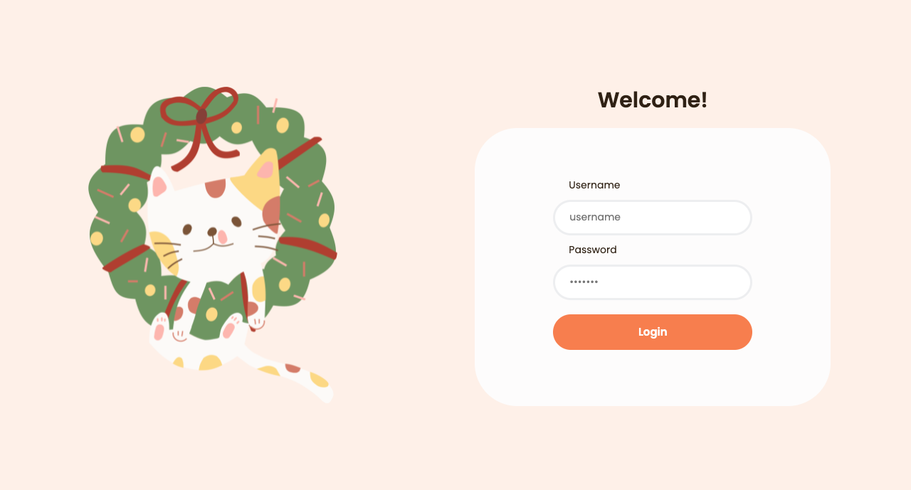

# E-Commerce
E-Commerce es una web app responsive que desarrollé en Angular aplicando movile first y consumiendo una API por primera vez.
En ella puedes ingresar con un usuario y contraseña, ver todos los productos y filtrarlos por "jewelery", "electronics", "men's clothing" y "women's clothing". También puedes agregar y eliminar productos al carrito de compras (la información es persistente) y puedes observar el importe total del pedido.

## ¿Cómo ingreso?
Debes usar uno de los usuarios [ya registrados en la API](http://fakestoreapi.com/users).

### Ejemplo:

usuario: jimmie_k

contraseña: klein*#%*

## Desktop:

## Movile:

## Menciones: 
- Usé [Fake Store Api](http://fakestoreapi.com/) para los productos y usuarios.

- [Este diseño](https://dribbble.com/shots/15550702-E-commerce-Mobile-App/attachments/7332953?mode=media) fue mi inspiración.

- Los íconos navideños son de [Flaticon](https://www.flaticon.com/)

- El gatito lo hice en figma tomando [este gif](https://giphy.com/stickers/merrychristmas-wreath-merryxmas-U2RQriOuvY06C7Mmga) como inspiración.

<h2 align="center">¡Muchas gracias!</h2>